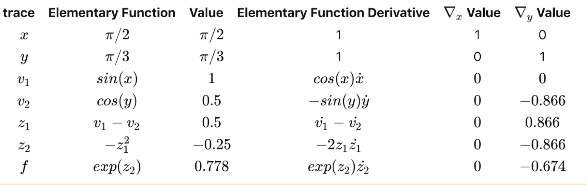
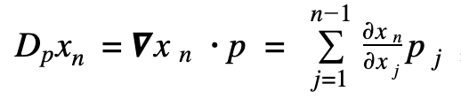

## Introduction


Farad (Forward and Reverse Automatic Differentiation) is a PyPi-distributed Python library for performing forward and reverse automatic differentiation, empowering the user with the ability to efficiently generate function derivatives with machine precision.

## Background

**Automatic differentiation** (AD) is a method of computing function derivatives in a programmatic fashion. It can be contrasted with **symbolic differentiation**, which involves manual calculation and encoding of the derivative by a user, and **numerical differentiation**, which entails the use of finite difference methods to approximate derivatives. Both of these methods are suboptimal.

Symbolic differentiation requires either user input or a near-infinitely sized lookup table, neither of which are practically feasible when working with large numbers of functions or especially complex functions. Numerical differentiation does not typically require explicit user input, but approximations often become poor due to the magnification of floating point errors, severely limiting the accuracy of approximations.

AD, on the other hand, resolves these issues. Only elementary functions are encoded, and complex functions are decomposed into a series of operations with elementary functions using a computational graph structure. This is done via the chain rule, which allows derivatives to be fragmented into simpler ones that become trivial to solve. In addition, the computational complexity of automatic differentiation functions are proportional to the underlying code complexity in most cases, meaning the method can be implemented with only a minor impact on runtime.

Forward mode AD can be achieved using dual numbers, which are formally described as Taylor series truncated at the first term, x+ epsilon x'. By definition, dual numbers exhibit the property epslion^2=0. Using dual numbers, a function can be defined by

f(x+x')=f(x)+ epsilon f'(x)x'

The advantage of this definition is that it allows derivatives to be carried around as part of the data structure. The chain rule can also be applied using dual numbers

f(g(x+ epsilon x'))=f(g(x)+ epsilon g'(x)x')=f(g(x))+ epsilon f'(g(x))g'(x)x'

The coefficient of  in this equation is equal to the derivative of the composite of the functions f and g. By isolating this part of the function and setting epsilon =1, a value for the derivative can be obtained. The farad library implements similar functions for all primitive mathematical operations. The reverse mode AD method will not utilize the dual numbers implementation.

## How to Use Farad

As an encapsulated library, a user will easily interact with it by simply importing the library into the notebook.

The user can install the Farad package via the preferred installer program (pip):
```bash
>>> pip install Farad
```
The following example demonstrates how a user will interface with Farad:
```python
>>> import Farad as ad
>>> d_power = ad.exp(ad.pow(ad.var(‘x’), 2)))  # instantiation of AD object for exp(2*x)
>>> # This could also be implemented as ad.exp(ad.var(‘x’)**2)
>>> d_power.forward({‘x’,0.5})
5.43656366
>>> d_power.reverse()
```

The `var` method is used to instantiate independent variables in the AD workflow. The `pow` and `exp` methods are numpy-derived and perform the power and exponential operations respectively. The `pow` method can also be implemented using the `**` operation as a result of operator overloading.

## Software Organization

A proposed layout for the directory tree is outlined below. The project will have separate directories for performing tests (actionable by the pytest library). The copyright license used will be the permissive MIT License 2.0. Documentation will be created using Sphinx and hosted externally on Read The Docs. A folder for applications will exist to demonstrate several example use cases of the library in action. Source files for the forward and reverse mode functions will be placed under the autodiff folder. A requirements.txt file and setup.py file will be present to allow the package to be distributed via PyPi and for easy user setup of the package.

```
master
├── LICENSE
├── README.md     
├── docs
│   ├── sphinx_docs
│   └── design documents
├── requirements.txt
├── travis.yml
├── .readthedocs.yml
├── .gitignore
├── setup.py
├── farad
│   ├── __init__.py
│   └── ...
├── tests
│   ├── __init__.py
│   └── ...
└── applications
    └── ...
```

The main module for this library will be farad, which contains all of the callable submodules used for automatic differentiation. Three other modules (directories) will also be created, (1) docs, containing documentation and milestone information for the project, (2) applications, containing several use case examples of the farad library, and (3) tests, containing unit tests for farad submodules.

The package will be augmented by continuous integration, implemented via TravisCI. Travis performs automated testing of submodules upon changes to source code. In addition, CodeCov will be used for performing coverage assessment of packaged code.

The package will be distributed via PyPi in the format outlined in the above-mentioned directory tree. The only anticipated package dependency will be numpy.

## Implementation

Our plan on implementing forward mode AD is as follows.

### Core data structures

- Dual number, vectors, or tensors, including the value and derivatives.
- Since dual numbers cannot be used to implement reverse mode AD, an alternative method will be used.

### Classes to use

- First, we have a dual number class. This class can be instantialized by scalar or vectors. To deal with the case of function with vector input, e.g. f(x1,x2,x3,…,xn), we have been implementing our dual number class to include derivatives with respect to all input dimensions (from x1 to xn) in the derivative attribute of our dual number object. That is, for a farad object y, we have y._der = [dydx1, dydx2,..., dydxn].
- For the case of vector functions, e.g. g(x) = [f1(x), f2(x), f3(x)], we will also define a dual vector class in addition to the dual number class. A dual vector object needs to be instantialized with dual number objects, e.g., g  = dual_vector(f1,f2,f3). Then we expect to get the Jacobian matrix through either g.forward or g._der.


### Methods and name attributes

- Methods include all the mathematical operations: addition, multiplication, division, trigonometric (sin, cos, tan), power, logarithmic, exponential, hyperbolic (sinh, cosh, tanh), as well as multiple complex operators (e.g., arcsin, arctanh, tetration). Methods will also be implemented via operator overloading where possible.
- Name attributes include function value and derivative.

### How will you deal with elementary functions like sin, sqrt, log, and exp (and all the others)?

- For elementary functions like sin, sqrt, log, and exp (and all the others), we will create (overload) separate functions as class methods for each of the elementary functions. Compatibility will also be made for numpy functions (and potentially scipy) for added functionality and cross-compatibility.

Note: The description above is for forward mode automatic differentiation. For reverse mode (in the advanced features), since dual numbers cannot be used to implement reverse mode automatic differentiation, an alternative method will be used.

## Advanced Feature(s)
-	The addition of reverse mode automatic differentiation
-	The use of Farad in several use cases involving differential equations

##  References

https://github.com/autodiff/autodiff<br/>
https://github.com/HIPS/autograd <br/>


## Feedback

### Milestone1

##### (A)
2/2 Introduction:
Would have been nice to see more about why do we care about derivatives anyways and why is Farad a solution compared to other approaches?

##### Response :

Differential equations play an overarching role in science research. From Maxwell’s electromagnetic equations to Shroedinger’s quantum theory, from pandemic disease models to spreading fake news models, researching functions and their derivatives in differential equations empower people to understand the essence of nature.

With more advanced computing science and algorithms, scientists and engineers are now able to find the solutions to more complicated differential equations. Therefore we create Farad, a more user-friendly software library which helps users perform the differential calculation in a more straightforward way and enables users to concentrate more on the essence of science rather than the programmatic computing process.


##### B
1.5/2 Background
Good start to the background.  The flow could have been enhanced by presenting the evaluation trace and a computational graph.
Going forward, I would also like to see a discussion on what forward mode actually computes (Jacobian-vector product), the “seed” vector, and the efficiency of forward mode.

##### Response:

One of the powerful features of automatic differentiation is the forward mode. In forward mode when the user considers to evaluate a function at the given point, the derivative result can easily be calculated by generating the evaluation trace and evaluation graph based on chain rule. Here is an example to illustrate the procedure of forward mode:

Consider the function f (x, y) = exp(-(sin(x) - cos(y))^2) to be evaluate at (𝜋/2, 𝜋/3), we can firstly create the evaluation graph:


Then the evaluation trace of the functions in each step:


Furthermore, if we are going to apply forward mode of AD for both scalar functions and vector functions of multiple variables, we introduce the Jacobian matrix J = 𝜕fi/𝜕xj and the seed vector p. By applying these two elements to a function, we can define the directional derivative as 
 , which represents the derivative of x_n (f) in the direction of the vector p. This can also be interpreted that the forward mode of AD is actually computing the product of the gradient of a function with the seed vector.

From the evaluation graph and evaluation trace of forward mode, the differentiation process can be illustrated in a quite straightforward way.


##### C
4.5/5 Implementation
1. How will you handle vector valued functions?
2. Why do you have a scipy dependency?
3. Will you be using numpy under-the-hood to implement your elementary functions?

##### Response 1:

For the case of vector input, e.g. f(x1,x2,x3,…,xn), we have been implementing our dual number class to include derivatives with respect to all input dimensions (from x1 to xn) in the derivative attribute of our dual number object. That is, for a farad object y, we have y._val = y_value, y._der = [dydx1, dydx2,..., dydxn].

For the  case of vector functions, e.g. g(x) = [f1(x), f2(x), f3(x)], we define a dual vector class in addition to the dual number class. A dual vector object needs to be instantialized with dual number objects, e.g., g  = dual_vector(f1,f2,f3). Then we expect to get the Jacobian matrix through either g.forward or g._der.

We have modified the “Classes to use” subsection in the Implementation section according to what we mentioned above.

##### Response 2:

A numpy dependency should be enough for  most of the elementary functions. Just in case the user-defined functions include scipy functions, we hope we could potentially deal with those rare situations. For the minimum requirement of the forward mode implementation, we won’t have a scipy dependency. For the case when the input function includes scipy, a scipy dependency may be included in our implementation.

##### Response 3:

Yes, we will use numpy under-the-hood when we implement elementary functions, eg. cos(), sin(), power(),log(), exp(), cross() and ndarry for vector.
