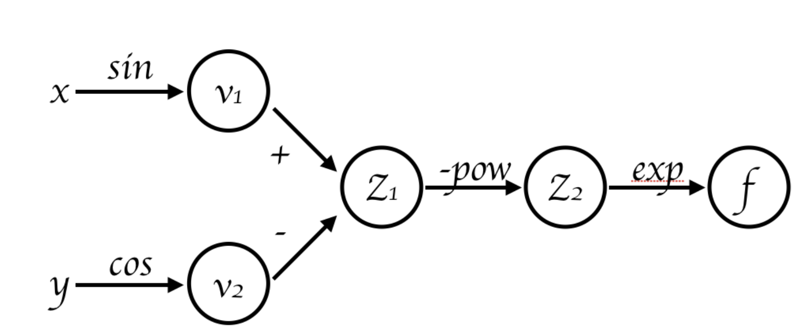
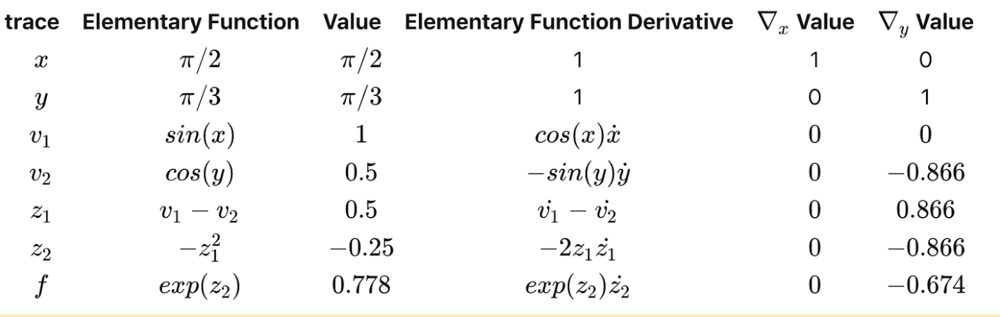

.. Farad documentation master file, created by
   sphinx-quickstart on Wed Nov  4 13:12:54 2020.
   You can adapt this file completely to your liking, but it should at least
   contain the root `toctree` directive.

Welcome to Farad's documentation!
=================================

.. image:: faradlogo.png

The forward and reverse automatic differentiation (Farad) package provides the ability
to automatically calculate derivatives to machine precision. This is extremely useful
for applications ranging from scientific computing with differential equations to deep
learning algorithms. This technique is especially useful when the overhead of symbolic
derivatives is infeasible or the accuracy numerical differentiation is insufficient.

Differential equations play an overarching role in science research. From Maxwell’s
electromagnetic equations to Shroedinger’s quantum theory, from pandemic disease models
to spreading fake news models, researching functions and their derivatives in differential
equations empower people to understand the essence of nature.

With more advanced computing science and algorithms, scientists and engineers are now able
to find the solutions to more complicated differential equations. Therefore we create Farad,
a more user-friendly software library which helps users perform the differential calculation
in a more straightforward way and enables users to concentrate more on the essence of science
rather than the programmatic computing process.

Farad uses dual numbers connected in a computational graph to sequentially compute
derivatives in the forward automatic differentiation mode. This package is also capable
of performing reverse automatic differentiation, with several examples of several use-cases
of the library for solving problems requiring accurate derivatives.

Background
==========

Automatic differentiation (AD) is a method of computing function derivatives in a programmatic fashion.
It can be contrasted with symbolic differentiation, which involves manual calculation and encoding of
the derivative by a user, and numerical differentiation, which entails the use of finite difference methods
to approximate derivatives. Both of these methods are suboptimal.

Symbolic differentiation requires either user input or a near-infinitely sized lookup table, neither of which
are practically feasible when working with large numbers of functions or especially complex functions.
Numerical differentiation does not typically require explicit user input, but approximations often become poor
due to the magnification of floating point errors, severely limiting the accuracy of approximations.
AD, on the other hand, resolves these issues. Only elementary functions are encoded, and complex functions
are decomposed into a series of operations with elementary functions using a computational graph structure.
This is done via the chain rule, which allows derivatives to be fragmented into simpler ones that become trivial
to solve. In addition, the computational complexity of automatic differentiation functions are proportional to the
underlying code complexity in most cases, meaning the method can be implemented with only a minor impact on runtime.
Forward mode AD can be achieved using dual numbers, which are formally described as Taylor series truncated at the
first term, :math:`x+\epsilon x'`. By definition, dual numbers exhibit the property :math:`\epsilon^2 = 0`.
Using dual numbers, a function can be defined by

:math:`f(x+\epsilon x')=f(x)+ \epsilon f'(x) x'`

The advantage of this definition is that it allows derivatives to be carried around as part of the data structure.
The chain rule can also be applied using dual numbers

:math:`f(g(x+\epsilon x'))=f(g(x)+\epsilon g'(x)x')=f(g(x))+\epsilon f'(g(x))g'(x)x'`

The coefficient of :math:`\epsilon` in this equation is equal to the derivative of the composite of the functions :math:`f` and :math:`g`.
By isolating this part of the function and setting :math:`\epsilon = 1`, a value for the derivative can be obtained.
The farad library implements similar functions for all primitive mathematical operations. The reverse mode AD method will
not utilize the dual numbers implementation.

One of the powerful features of automatic differentiation is the forward mode. In forward mode when the user considers
to evaluate a function at the given point, the derivative result can easily be calculated by generating the evaluation
trace and evaluation graph based on chain rule. Here is an example to illustrate the procedure of forward mode:

Consider the function :math:`f (x, y) = exp(-(sin(x)-cos(y)^{2}))` to be evaluate at :math:`(\pi/2, \pi/3)`, we can firstly create the
evaluation graph:

Then the evaluation trace of the functions in each step:

Forward mode
--------------------

Furthermore, if we are going to apply forward mode of AD for both scalar functions and vector functions of multiple variables,
we introduce the Jacobian matrix :math:`J = \frac{\partial f_i}{ \partial x_j}` and the seed vector :math:`p`. By applying these two elements to a function, we can define
the directional derivative as :math:`D_p x_n = \nabla x_n \cdot p = \sum^{n-1}_{j=1} \frac{\partial x_n}{\partial x_j} p_j`, which represents the derivative of :math:`x_n(f)` in the direction of the vector :math:`p`. This can also
be interpreted that the forward mode of AD is actually computing the product of the gradient of a function with the seed vector.

From the evaluation graph and evaluation trace of forward mode, the differentiation process can be illustrated in a
quite straightforward way.

Reverse mode
--------------------

Reverse mode AD (commonly known as backpropagation) is used in many neural networks frameworks, due to its efficiency and
accuracy. While the forward mode traverses the chain rule from inside to outside, the reverse one traverses it in an opposite
way, from outside to inside.The dependent variable to be differentiated is fixed and we compute the derivatives recursively.
Therefore, it requires us to store the intermediate variable in memory.
To calculate the derivatives, we use a dynamic approach: construct a graph that represents the original expression as
the program runs. We construct nodes for independent variables x and y. And we store information of nodes who are dependent
on the current node in its children, which will be used later to compute the gradients.

How to Use Farad
================

Farad is currently PyPi-distributed at https://pypi.org/project/farad/, simply install using the following terminal command:

.. code-block:: console

    pip install farad

User can also install farad locally by using the following terminal commands:

.. code-block:: console

   git clone https://github.com/The-Pyoneers/cs107-FinalProject.git  # clone repository with farad library
   virtualenv -p python3 envname  # create virtual environment for containerization (if necessary)
   pip install -r requirements.txt  # install dependencies

Farad is written solely in Python and requires Numpy for performing some mathematical operations. To import Farad into a
Python environment, run

.. code-block:: Python

   import farad as fd

Forward mode
--------------------

To check and ensure that the library is working, try running the following example

.. code-block:: Python

   import farad as fd
   import farad.driver as ad
   function = lambda x: 7 * x + 6 # simple linear equation - scalar function of scalar values
   f = ad.AutoDiff(function)
   f.values(7)  # return the value of f(x = 7)
   >>> [55]
   f.forward(7)  # return the derivative f'(x = 7)
   >>> [7]
   print(f.vals, f.ders)
   >>> [55] [7]

Elementary functions can also be used in the function definition, as follows

.. code-block:: Python

   import farad.elem as EL
   function = lambda x: 7 * EL.sin(x) + 6  # sine function
   f = ad.AutoDiff(function)
   f.values(7)  # return the value of f(x = 7)
   >>> [10.598906191031524]
   f.forward(7)  # return the derivative f'(x = 7)
   >>> [5.27731578]
   print(f.vals, f.ders)
   >>> [10.598906191031524] [5.27731578]

The use of multivariate objective functions is also supported, as follows

.. code-block:: Python

   function = lambda x1, x2: x1 * x2 + x1  # multivariate function - scalar functions of vectors
   f = ad.AutoDiff(function)
   f.values([2, 3])  # return the value of f([x1, x2] = [2, 3]), requires vector input
   >>> 8
   f.forward([2, 3])  # return the derivative f'([x1, x2] = [2, 3]), requires vector input
   >>> [4, 2]

The use of multiple objective functions is also supported, as follows

.. code-block:: Python

   function = lambda x1, x2: [x1 * x2 + x1, x1 / x2] # multiple objective functions - vector input of vectors
   f = ad.AutoDiff(function, dim=2)
   f.values([3, 2])  # return the value of f([x1, x2] = [3, 2]), requires vector input
   >>> [9, 1.5]
   f.forward([3, 2])  # return the derivative f'([x1, x2] = [3, 2]), requires vector input
   >>> [[3, 3], [0.5, -0.75]] # defaults to coefficients

Reverse mode
--------------------

To use reverse mode to calculate the value and derivatives of functions, you can check the following examples.

First, you need to load the following libraries:

.. code-block:: Python

   import farad.elem as EL
   import farad.driver as ad

1. for single function with scalar input

.. code-block:: Python

    f = lambda x: EL.sin(x) + EL.cos(x)
    function = ad.RAutoDiff(f)
    function.forwardpass(1.0)  # evaluate f(x) at x = 1.0
    function.values()
    >>> 1.3817732906760363
    function.reverse()
    >>> -0.30116867893975674

    # To evaluate the function at multiple points:
    function.forwardpass([1.0, 2.0, 3.0])  # evaluate f(x) at x = 1.0, 2.0, 3.0
    function.values()
    >>> array([ 1.38177329,  0.49315059, -0.84887249])
    function.reverse()
    >>> array([-0.30116868, -1.32544426, -1.1311125 ])

2. For single function with vector input

.. code-block:: Python

    f = lambda x, y: x * y
    function = ad.RAutoDiff(f)
    function.forwardpass([1, 2])  # evaluate f(x, y) at (x=1, y=2)
    function.values()
    >>> 2
    function.reverse()
    >>> array([2., 1.])

    # To evaluate the function at multiple points:
    function.forwardpass([[1,2],[3,4]])  # evaluate f(x, y) at (x=1, y=2), (x=3, y=4)
    function.values()
    >>> array([ 2., 12.])
    function.reverse()
    >>> array([[2., 1.],
           [4., 3.]])

3. For vector function:

.. code-block:: Python

    f1 = lambda x, y: x * y
    f2 = lambda x, y: 2 * x * y
    f = [f1, f2]
    function = ad.RAutoDiff(f)
    function.forwardpass([[1,2],[3,4]])  # evaluate [f1(x, y), f2(x, y)] at (x=1, y=2), (x=3, y=4)
    function.values()
    >>> array([[ 2.,  4.],
           [12., 24.]])
    function.reverse()
    >>> array([[[2., 1.],
            [4., 2.]],

           [[4., 3.],
            [8., 6.]]])

    # For vector functions, each individual function needs to contain exactly the same parameters with the orders.

You are now ready to use Farad!

Software Organization
=====================

The layout for the directory tree is outlined below. The project will have separate directories
for performing tests (actionable by the pytest library). The copyright license used will be the permissive
MIT License 2.0. Documentation will be created using Sphinx and hosted externally on Read The Docs. A folder
or applications will exist to demonstrate several example use cases of the library in action. Source files
for the forward and reverse mode functions will be placed under the autodiff folder. A requirements.txt
file and setup.py file will be present to allow the package to be distributed via PyPI and for easy user
setup of the package.

::

 farad_pkg
 ├── LICENSE
 ├── README.md
 ├── docs
 │   ├── sphinx_docs
 │   └── design documents
 ├── requirements.txt
 ├── .travis.yml
 ├── .readthedocs.yml
 ├── .codecov.yml
 ├── .gitignore
 ├── setup.py
 ├── setup.cfg
 ├── farad
 │   ├── __init__.py
 │   └── dual.py
 │   └── elem.py
 │   └── driver.py
 │   └── rnode.py
 ├── tests
 │   ├── __init__.py
 │   └── test_dual.py
 │   └── test_elem.py
 │   └── test_driver.py
 │   └── test_rnode.py
 └── examples
     └── root-finding.py

The main module for this library will be farad, which contains all of the callable submodules used
for automatic differentiation. Three other modules (directories) will also be created, (1) docs, containing
documentation and milestone information for the project, (2) applications, containing several use case examples
of the farad library, and (3) tests, containing unit tests for farad submodules.

The package will be augmented by continuous integration, implemented via TravisCI. Travis performs automated
testing of submodules upon changes to source code. In addition, CodeCov will be used for performing coverage
assessment of packaged code.

The package will be distributed via PyPI in the format outlined in the above-mentioned directory tree.
The only anticipated package dependency will be numpy in order to reduce reliance on external libraries
and reduce the complexity of the code base. Additional dependencies will be used during testing and packaging.

Implementation details for forward mode
=======================================

Our plan on implementing forward mode AD is as follows.

Core data structures
--------------------

- Dual number, vectors, or tensors, including the value and derivatives.
- Since dual numbers cannot be used to implement reverse mode AD, an alternative method will be used.

Classes to use
--------------

First, we have a dual number class. This class can be instantialized by scalar or vectors. To deal with
the case of function with vector input, e.g. :math:`f(x_1,x_2,x_3,...,x_n)`, we have been implementing our dual number
class to include derivatives with respect to all input dimensions (from :math:`x_1` to :math:`x_n`) in the derivative
attribute of our dual number object. That is, for a farad object :math:`y`, we have :math:`y_{der} = [\frac{dy}{dx_1}, \frac{dy}{dx_2},..., \frac{dy}{dx_n}]`.

Then, we also have driver class called AutoDiff. This class can be instantialized by user-defined function.
In this class, we have valuesue method to return the value of the function, and we have forward method
to return the derivative using the forward mode. Currently this driver class can only deal with scalar function input.
For vector functions, e.g. :math:`g(x) = [f_1(x), f_2(x), f_3(x)]`, we also implement this class so that the
forward method can return a Jacobian matrix.

Methods and name attributes
---------------------------

Methods include all the mathematical operations: addition, multiplication, division, trigonometric
(sin, cos, tan), power, logarithmic, exponential, hyperbolic (sinh, cosh, tanh), as well as multiple
complex operators (e.g., arcsin, arctanh, tetration). Methods will also be implemented via operator
overloading where possible. Name attributes include function value and derivative.

How will you deal with elementary functions like sin, sqrt, log, and exp (and all the others)?
----------------------------------------------------------------------------------------------

Creating (overloading) separate functions as class methods for each of the elementary functions.
Compatibility will also be made for numpy functions (and potentially scipy) for added functionality
and cross-compatibility.

We will use numpy under-the-hood when we implement elementary functions, eg. cos(), sin(), power(),
log(), exp(), cross() and ndarry for vector.

A numpy dependency should be enough for most of the elementary functions. Just in case the user-defined
functions include scipy functions, we hope we could potentially deal with those rare situations. For
the minimum requirement of the forward mode implementation, we won’t have a scipy dependency. For
the case when the input function includes scipy, a scipy dependency may be included in our implementation.

Implementation details for reverse mode
=======================================

Core data structures
--------------------

Tree data structure. Each node of the tree will contain the value of the node and the derivative relationship between the node and its children.
For example, for z = x + y, z is the children of node x and node y. The node of x contains the value of x and also :math:`{\partial z / \partial x}`.

Classes to use
--------------

First, we have a Rnode class. This Rnode class is used for the data structure mentioned above. In an Rnode object, the
value of the node and the relationship between this node and its children nodes are stored.

Then, we also have driver class called RAutoDiff. It's an interface for users to specify the functions
and the input parameters. The RAutoDiff object can be instantialized by user-defined function. RAutoDiff
contains the following methods to return the value and derivatives of the function:
1. values() is for getting the value of the function.
2. reverse() is for getting the derivative of the variables via reverse AD mode.
3. forwardpass() is to constructor the tree structure required to perform reverse AD
calculation. forwardpass needs to be called before using values() and reverse().

Methods and name attributes
---------------------------

Methods include all the mathematical operations: addition, multiplication, division, trigonometric
(sin, cos, tan), power, logarithmic, exponential, hyperbolic (sinh, cosh, tanh), as well as multiple
complex operators (e.g., arcsin, arctanh, tetration). Methods will also be implemented via operator
overloading.

In the Rnode class, grad() method is used to recursively calculate the derivatives. This method should be
used in code-developing level. The users should use methods in RAutoDiff class to get the value and derivatives
of the function.

Methods for RAutoDiff object have been mentioned in the Classes to use section and is illustrated in the demo
codes in the How to use section.

Our implementation needs a numpy dependency. We use numpy under-the-hood when we implement elementary functions, eg. cos(), sin(), power(),
log(), exp(), cross() and ndarry for vector as well as when we write the RAutoDiff class.

Future Features
===============

**Neural network application**

We plan to develop a layer class and optimizer to allow this library to be
run for neural networks. An example application will be given on the MNIST dataset, which will benchmark
against a standard neural network library such as Pytorch or Tensorflow for comparison. We also
want to include other functionalities such as saving and importing neuron weights.

The use of a layer abstraction allows simpler interfacing with the farad library, especially for large inputs. For example, images in MNIST are relatively small, consisting of only 28x28 pixels. However, when flattened this extends to an input vector of 784 neurons, which is not easily manageable without this abstraction. Multiple layers can be linked together in a computational workflow to produce complex network architectures comparable to those of standard neural network libraries such as Tensorflow and Pytorch, which can be used as a benchmark for comparing performance.

In addition to what we have accomplished, we also need to deal with matrix/array operations to better apply our automatic differentiation package to tasks related to neural networks
For large neural network, matrix operation seems inevitable. Take reverse mode for example, which could be
more time-efficient in nueral network calculation, we could use a array-like data structure in a new class. Individual element of in the
array would be our Rnode object. In this new class, we can overload common operators
to support matrix/array operation.

Broader Impact and Inclusivity Statement
========================================

**Inclusivity.** Science as a discipline exists without prejudice or favoritism. Its universal goal is to uncover the truth
about the physical world, be it through discovery or ingenuity. Researchers from disparate fields as well as
widely varying socioeconomic, cultural backgrounds, and ability are united by solely one thing: potential. Open-source
software is no exception. Contributors are united in the pursuit for progress to tackle existing challenges
facing humanity and enhancing already-existing solutions. The core developers of Farad share in this worldview and are committed
to ensuring that every individual, regardless of background, is able to contribute to improve our existing code base. To help
foster inclusivity, contributors should be respectful of other developers regardless of their identity, and understanding towards
those still in the process of learning about diverse perspectives and identities. Differences of opinion may arise and should be
resolved amicably, exercising an unwavering commitment to respect, tolerance, and restraint. Pull requests will be reviewed blindly by a
a minimum of two core developers to help mitigate unconscious bias. To make the package more accessible,
documentation should be written in a way that is understandable to non-native English speakers. When language confusion arises, consideration
should be made for assuming good intent of the speaker. Ideas and feedback for fostering an increasingly inclusive developer ecosystem are
encouraged. All are welcome.

**Broader Impact.** Automatic differentiation is applicable to almost every discipline of science and engineering. Consequently, the development
of an automatic differentiation library can have far-reaching implications, from the solving of differential equations in thermodynamics, electromagnetism,
and fluid mechanics, to the creation of neural networks for classifying images or interpreting text data. Stemming from these applications, real-world consequences
arise which can have implications for individual privacy, safety, and well-being. To promote a more ethical and socially desirable innovation process,
contributors are encouraged to point out any potential consequences of decisions and discuss these seriously in a transparent and interactive manner. In general,
updates should not adversely impact or deter any disadvantaged groups and should aim to increase the speed at which results are obtained.

.. toctree::
   :maxdepth: 2
   :caption: Contents:

Indices and tables
==================

* :ref:`genindex`
* :ref:`modindex`
* :ref:`search`
